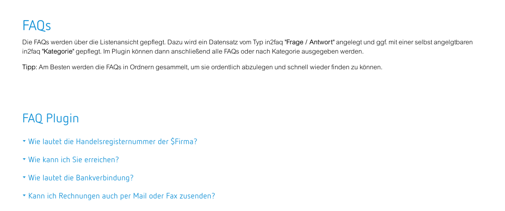

# EXT:in2faq

To render questions and answers as TYPO3 extension as a possible follower for EXT:irfaq.

## Explanation

There are two plugins. The first plugin shows the questions and answers. The second allows you to set a filter over your
question list. There is a filter by search term and a category filter.

A command controller allows you to import old EXT:irfaq records into new tables

## Changelog

| Version    | Date       | State      | Description                                                                                                                                                                                |
| ---------- | ---------- | ---------- | ------------------------------------------------------------------------------------------------------------------------------------------------------------------------------------------ |
| 4.1.4      | 2021-07-13 | Task       | Small code cleanup |
| 4.1.3      | 2021-06-28 | Bugfix     | Set default value in TCA for `l10n_parent` |
| 4.1.1      | 2019-04-08 | Bugfix     | Don't use same startpage for plugins when plugin is inserted more then once per page |
| 4.1.0      | 2019-02-13 | Feature    | Pi2: Show categories from given startpoint. If empty, show all. Also pass tt_content.* to views. |
| 4.0.1      | 2019-02-11 | Bugfix     | Remove unneeded version from composer.json. |
| 4.0.0      | 2019-02-10 | Task       | Update for newer TYPO3 versions. Add a filter functionality. |
| 3.0.0      | 2019-03-31 | Task       | Update for TYPO3 9 |
| 2.0.3      | 2019-03-31 | Task       | Update dependencies |
| 2.0.2      | 2019-03-31 | Task       | Update dependencies |
| 2.0.1      | 2017-08-04 | Bugfix     | Small bugfix |
| 2.0.0      | 2017-06-06 | Task       | Preperations for TYPO3 8 |
| 1.0.0      | 2016-07-26 | Task       | Initial release |

